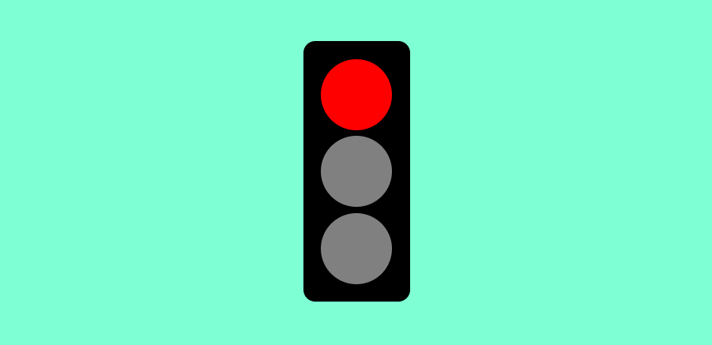

# Project DOM - Traffic Light

This project is for training only. This project implement basic DOM to manipulate HTML Content to create a traffic light.

## Preview



## How to Run this Project

1. Clone this project
```
git clone https://github.com/mdavindarinaldy/fgo24-dom-traffic-light.git
``` 
2. Run the project

## Dependencies
This project don't have any dependencies

## Resource Reference
Image References:
```
https://hosnews.id/gambar-pemandangan-gunung/
https://i0.wp.com/dianisa.com/wp-content/uploads/2022/10/6-Gambar-pemandangan-gunung-dan-jalan-raya.jpg?ssl=1
```

## Basic Information
This project is part of training in Kodacademy Bootcamp Batch 24 made by Muhammad Davinda Rinaldy